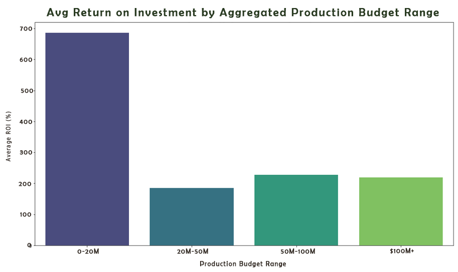
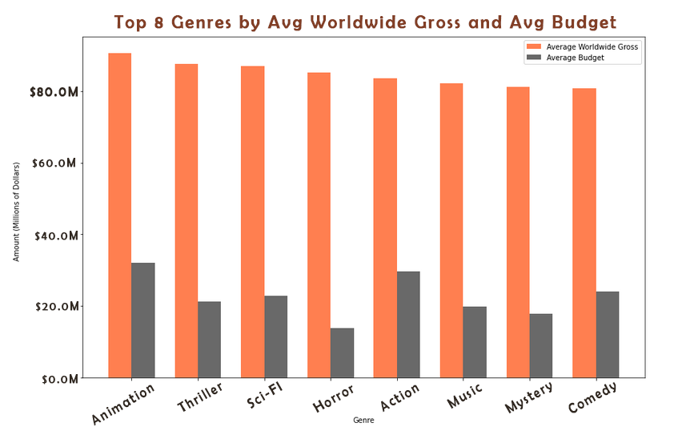
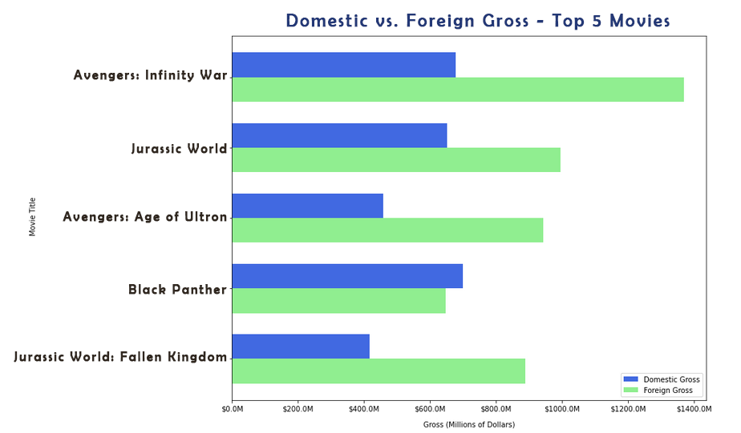
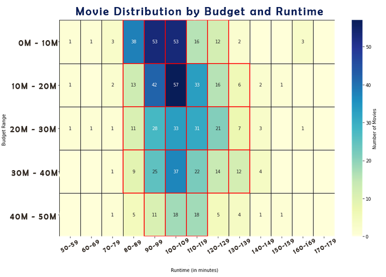
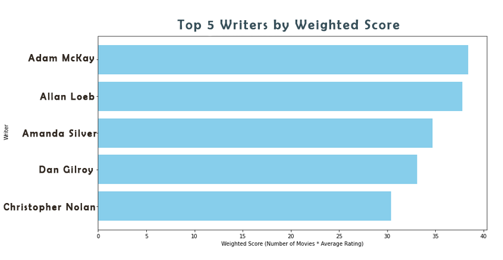
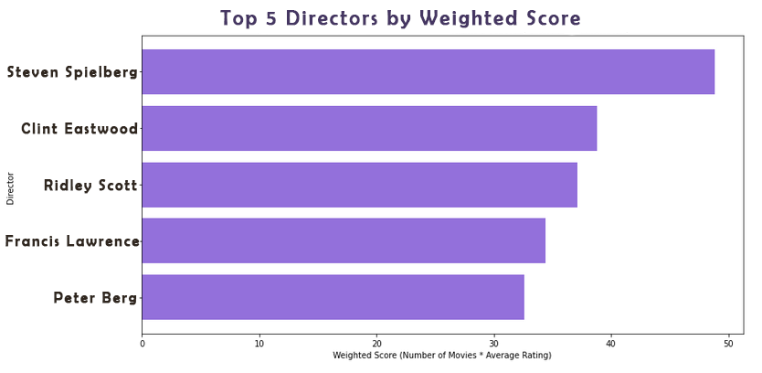
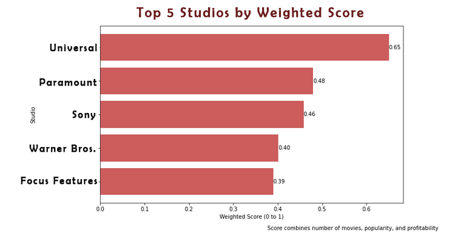

# Movie Success Analysis

## Project Overview

This project aims to analyze a dataset of movies to uncover insights and patterns that can inform decision-making for movie studios and production companies. By leveraging data science techniques, we explored various aspects of movie success, including budget allocation, audience engagement, and genre preferences.

## Data Analysis

The analysis focused on the following key areas:

1. **Budget Allocation**: We evaluated the distribution of movie budgets to identify optimal investment ranges for maximizing return on investment, emphasizing the advantages of lower budgets (under $20 million) and the potential for brand growth with budgets between $20 and $50 million.

2. **Genre Profitability**: We analyzed popular movie genres to determine which are most profitable within specific budget ranges, identifying Horror as the leading genre for lower budgets and Animation for higher budgets.

3. **Production Strategy**: We examined strategies for enhancing project success, including recruiting recognizable talent and selecting genres that align with budget considerations, to inform decision-making for future productions.

---

## Business Understanding
Our company is looking to enter the movie production industry by creating a new movie studio. However, we lack experience and insights into what types of films are currently performing well at the box office. The goal of this project is to conduct exploratory data analysis on various movie datasets to uncover trends and patterns that can guide our decision-making process when it comes to selecting the genres, themes, and styles of films to produce.

The key objectives are:

- Analyze box office performance data to identify the most successful and popular movie genres, themes, and styles in recent years.
- Explore factors that contribute to a film's success, such as critical reviews, audience ratings, production budgets, and marketing strategies.
- Generate actionable insights and recommendations for the head of our new movie studio, providing data-driven guidance on the types of films they should consider producing to maximize potential returns.

---

## Data Understanding

For our analysis, we are pulling from a few popular movie databases. 

- **IMDB** : Popular online database for movie and TV Information
- **Rotten Tomatoes** : Reviews, viewer engagement, and public response
- **Box Office Mojo** : Comprehensive source for box office data and analysis
- **The Numbers** : Movie industry data and financial analysis resource
- **TheMovieDB** : A popular, user editable database for movies and TV shows.

### Data Limitations:

Incomplete coverage:
    Our dataset really only analyzes movies from 2010 to 2020. It will not include every movie ever made.
    Older and more obscure films might be missing
    
Subjectivity in user-generated content:
    Ratings and reviews can be subjective, and may not always reflect the opinion of the broader audience
    
Potential inaccuracies in financial data:
    Reporting standards will vary, especially for older movies.
    Currency fluctiations over time will affect financial data accuracy (as, for example, the USD changes in worth)

Despite these limitations, our chosen databases are well-known and reputable sources, and have an extensive coverage of movies and their related information. This will provide us a solid foundation for analyzing valuable insights into movie industry trends and patterns.

---

## Business Recommendations and Visualizations

### How much should we invest into the production budget?

**For Higher Return on Investment:** I recommend focusing on the **$0 - $20M range** as a safe investment strategy to achieve higher returns quickly. 

**For Increased Popularity:** If the goal shifts towards brand recognition and building a strong portfolio, I suggest exploring budgets in the **$20M - $50M range**. This is an opportunity for growth despite potentially lower initial returns.

---

### What genres will be the most profitable?

For lower budgets (under $20 million), the most profitable genre is **Horror**, with **Music** and **Mystery** also showing strong potential. 

For higher budgets, **Animation** tops the list, followed by **Thriller** and **Sci-Fi**.

---

### Does Foreign Gross matter?

For the top five movies in our dataset, foreign gross revenue significantly outweighed domestic earnings. In fact, four out of the five top movies achieved higher foreign gross figures. This suggests that we should consider allocating resources to marketing efforts in international markets and ensuring accessibility for audiences in those regions.

---

### What runtime can we afford to produce?

I created a heatmap for Budget and Runtime, but lets limit the graph to only show our interested ranges:

Remember:
- **For Higher ROI:**  $0 - $20M
- **For Increased Popularity:** $20M - $50M 

For all of these ranges, it seems that our movies aim to be at least 1h 30m long, or **> 90 minutes**

With higher budgets, you might aim for a runtime closer to 2h, or **120 minutes**

---

### Recruiting: Who should we work with?

Working with well-known writers, directors, and production studios is a great way to boost your project’s chances of success. These experienced professionals can bring their skills and reputation to your production, making it more appealing to audiences and investors.

### Recommended Writers:
- Adam McKay
- Allan Loeb
- Amanda Silver
- Dan Gilroy
- Christopher Nolan

### Recommended Directors:
- Steven Spielberg
- Clint Eastwood
- Ridley Scott
- Francis Lawrence
- Peter Berg

### Recommended Studio Parters:
- Universal
- Paramount
- Sony
- Warner Bros.
- Focus Features

---

## Next Steps:

1. **Determine Your Production Budget:** For maximum Return on Investment, consider the `$0–20 million range`. If you aim for brand recognition and portfolio growth, explore budgets of `$20–50 million`, understanding that initial returns may be lower.

2. **Engage Recognizable Talent:** Recruit well-known writers, directors, or partner with a successful studio to enhance project appeal and attract investors.

3. **Choose a Profitable Genre:** Select a genre that aligns with your budget range and market potential.

4. **Optimize Runtime:** Aim for a runtime of 1.5 to 2 hours, tailored to your budget considerations.

## Repository Structure

- **README.md**: This file, providing an overview of the project.
- **images/**: Contains images used throughout the analysis for visualization purposes.
- **notebook.ipynb**: A Jupyter Notebook containing the detailed analysis and visualizations.
- **slides.pdf**: Presentation slides summarizing the key findings and recommendations.
- **temp/**: Temporary files used during the analysis process.
- **zippedData/**: Contains zipped datasets used for analysis.